# Paso 1 - Creación de Recursos en Azure

### Descripción general
 
1. Almacene datos no estructurados en la nube

Comenzaremos explorando cómo almacenar datos no estructurados, como archivos PDF, en la nube. Esta sección cubre los conceptos básicos de la carga de datos en Azure Blob Storage.

2. Creación de Azure OpenAI

Configuraremos un servicio de Azure OpenAI en nuestra cuenta de Azure.

3. Configuración de Modelo en Azure OpenAI Studio
 
Se realizará la configuración del Modelo en Azure OpenAI Studio y obtendremos datos de nuestras propias fuentes de datos.

### 1. Cree un contenedor de blobs

Azure Blob Storage es un servicio diseñado para almacenar grandes cantidades de datos no estructurados, como archivos PDF.

1. Para comenzar, cree una cuenta de Azure Storage escribiendo "cuentas de almacenamiento" en la barra de búsqueda y seleccionando Servicios - Cuentas de almacenamiento.
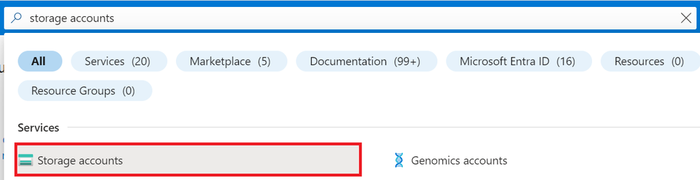

2. Seleccione el botón +Crear.

3. Ingrese el nombre del grupo de recursos que servirá como directorio para la cuenta de almacenamiento, ingrese el nombre de la cuenta de almacenamiento y seleccione una región. Cuando haya terminado, seleccione el botón Revisar.
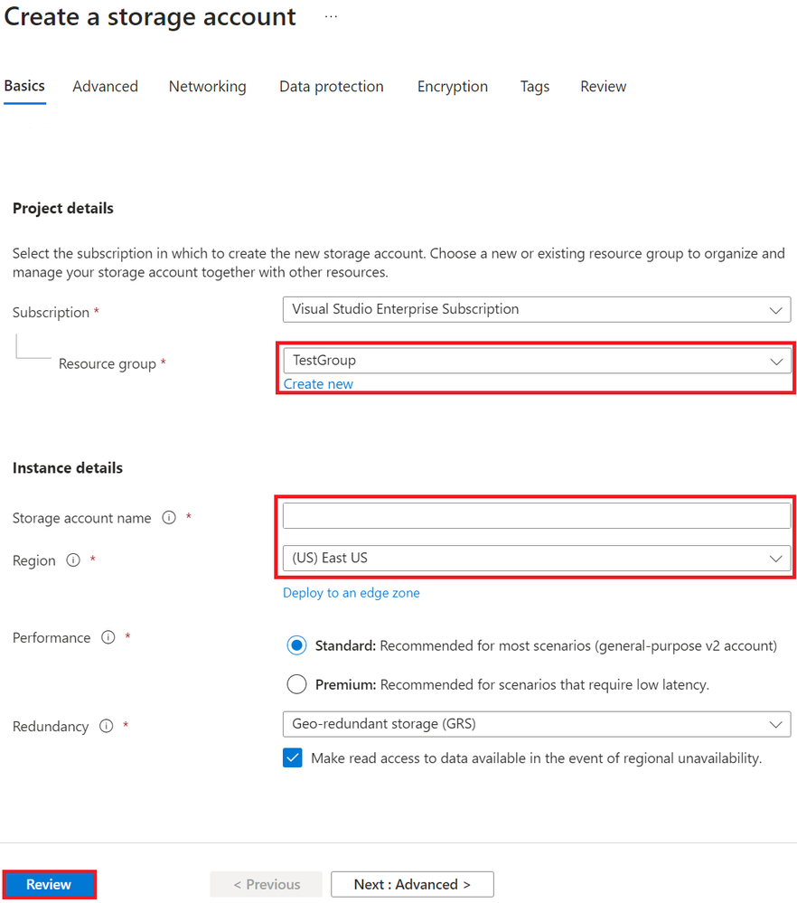

4. Seleccione el botón Crear.
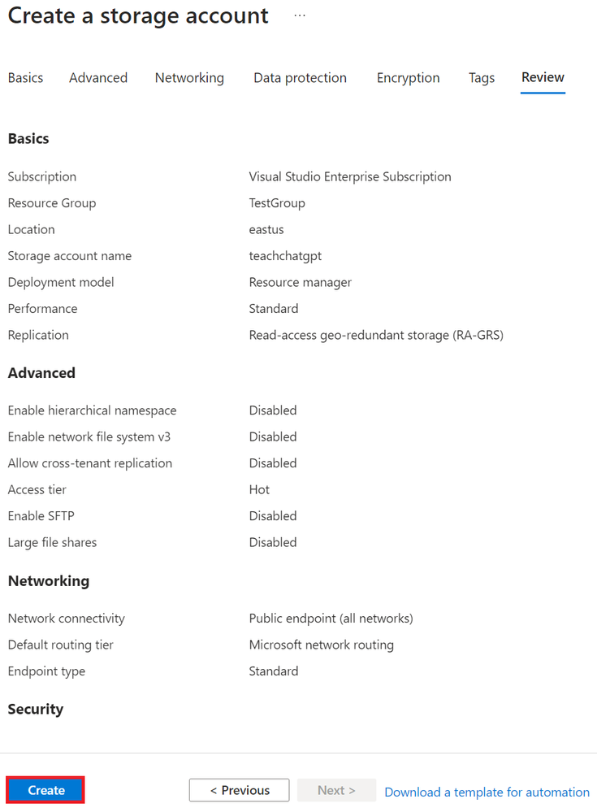

5. Una vez configurada su cuenta de almacenamiento, navegue hasta Explorador de almacenamiento escribiendo "navegador de almacenamiento" en la barra de búsqueda.
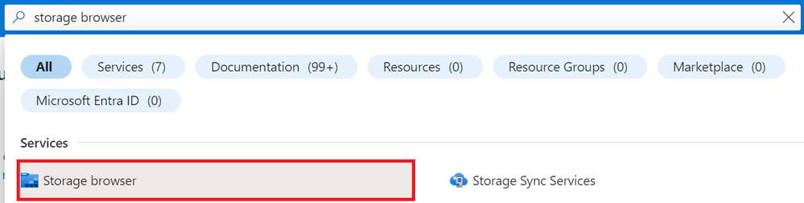

6. En el Explorador de almacenamiento, seleccione el almacenamiento de blobs que creó anteriormente.
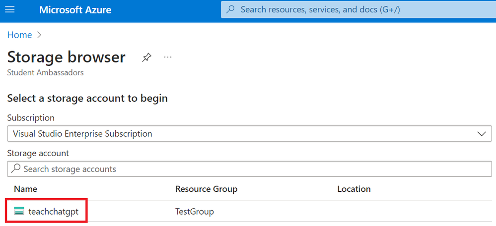

7. Agregue un nuevo contenedor para almacenar documentos PDF.
 
- Seleccione su cuenta de almacenamiento.
- Seleccione el botón Contenedores de blobs.
- Seleccione el botón +Agregar contenedor para crear un nuevo contenedor.
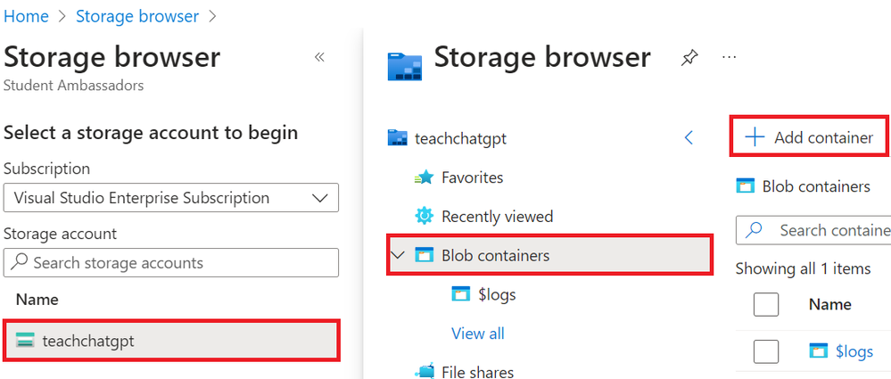

8. Visualizará el nuevo contenedor para almacenar archivos en el explorador de contenedores:

### 2. Crear un servicio OpenAI de Azure

Actualmente, el acceso al servicio Azure OpenAI se otorga únicamente mediante solicitud. Puede solicitar acceso al servicio Azure OpenAI completando el formulario en https://aka.ms/oai/access/.

1. Escriba 'azure openai' en la barra de búsqueda y seleccione Servicios - Azure OpenAI.
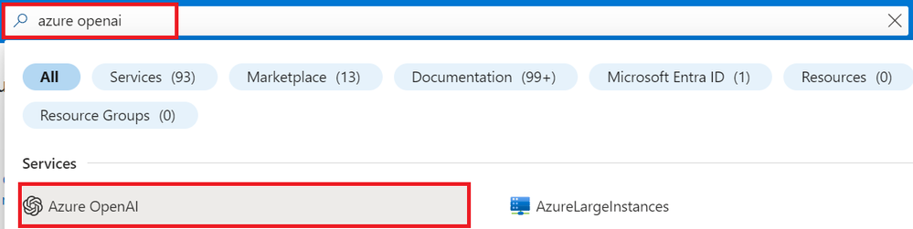
 
2. Seleccione el botón + Crear.
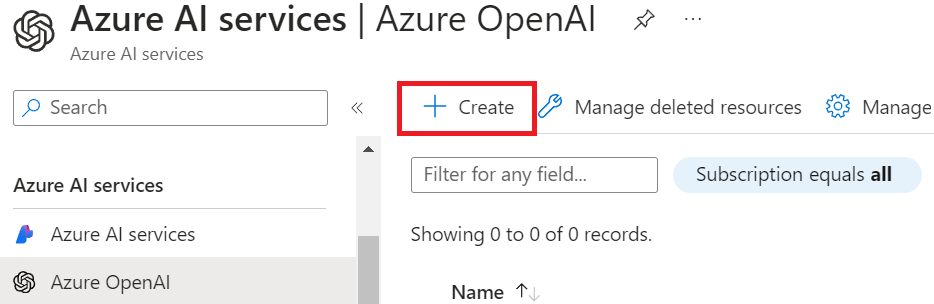
 
3. Complete los conceptos básicos.
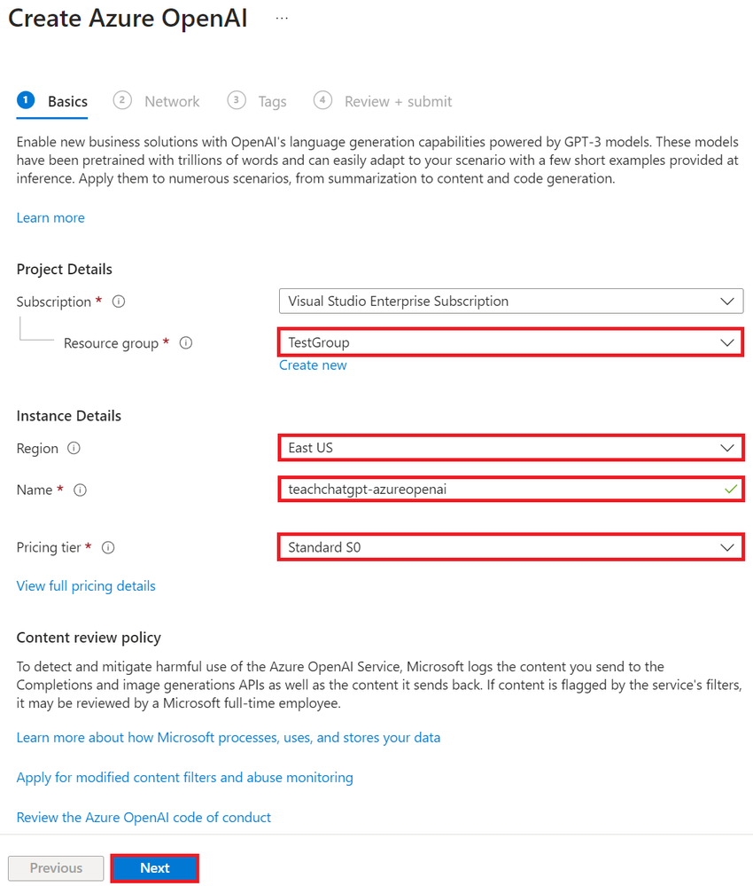

NOTA:
El recurso Azure OpenAI está disponible actualmente en regiones limitadas.
Si el recurso Azure OpenAI no está disponible en su región, le recomiendo configurar su ubicación en el Este de EE. UU.
 
4. Seleccione un tipo de seguridad de red.
 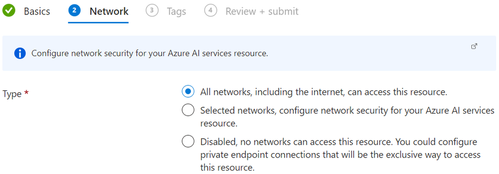
 
5. Seleccione el botón Crear.
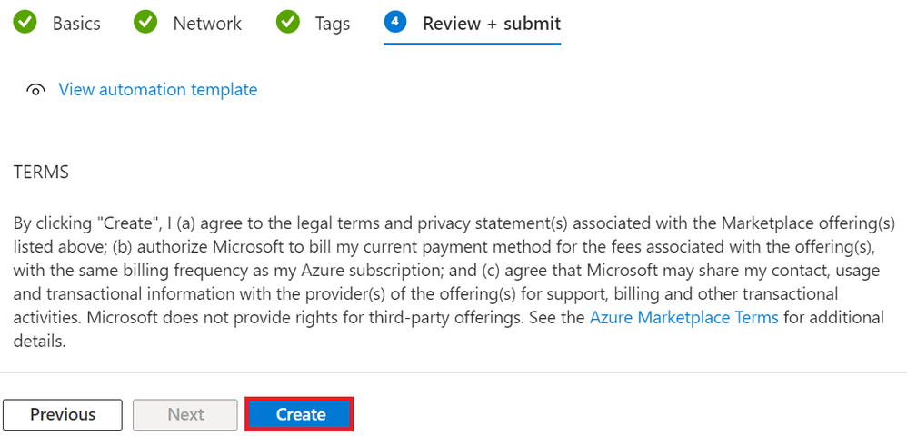

6. Implemente su modelo Azure OpenAI.
 
- Navegue hasta su Azure OpenAI, luego seleccione el botón Ir a Azure OpenAI Studio.
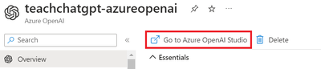

- En Azure openAI Studio, seleccione el botón Implementaciones.
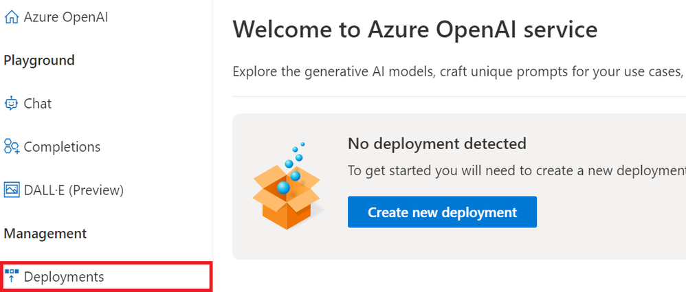
 
- Seleccione el botón + Crear nueva implementación, luego cree los modelos gpt-35-turbo y text-embedding-ada-002.

NOTA:
En este workshop usaremos los modelos gpt-35-turbo y text-embedding-ada-002. Recomiendo usar el mismo nombre tanto para el nombre de la implementación como para el nombre del modelo.
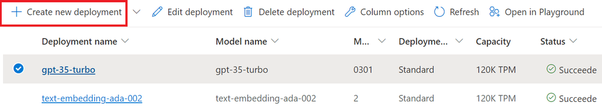

### 3. Agregue sus datos usando Azure OpenAI Studio

1. Seleccione en las opciones de inicio en Azure OpenAI Studio el área de juegos de Chat o Chat Playground.

2. En el panel de configuración del Asistente, seleccione Agregar sus datos (vista previa) > + Agregar una fuente de datos.

3. En el panel que aparece, seleccione Cargar archivos en Seleccionar fuente de datos. Seleccione Cargar archivos. Azure OpenAI necesita un recurso de almacenamiento y un recurso de búsqueda para acceder e indexar sus datos.

    a. Para que Azure OpenAI acceda a su cuenta de almacenamiento, deberá activar el uso compartido de recursos entre orígenes (CORS). Si CORS aún no está activado para el recurso de Azure Blob Storage, seleccione Activar CORS.

    b. Seleccione su recurso de Azure AI Search y seleccione la confirmación de que al conectarlo generará uso en su cuenta. Luego seleccione Siguiente.

5. En el panel Cargar archivos, seleccione Buscar un archivo (Seleccione el archivo del repositorio en la carpeta "resources") y seleccione los archivos que desea cargar. Luego seleccione Cargar archivos. Luego seleccione Siguiente.

6. En el panel de administración de datos, puede elegir si desea habilitar la búsqueda semántica o la búsqueda vectorial para su índice. Seleccione ambos.

7. Revise los detalles que ingresó y seleccione Guardar y cerrar. Ahora puede chatear con el modelo y utilizará información de sus datos para construir la respuesta.

### Probar el Área de Juegos del Chat

Comience a explorar las capacidades de Azure OpenAI con un enfoque sin código a través del área de chat. Es simplemente un cuadro de texto donde puede enviar un mensaje para generar una finalización. Desde esta página, puede iterar y experimentar rápidamente con las capacidades.

# FIN Paso 1
